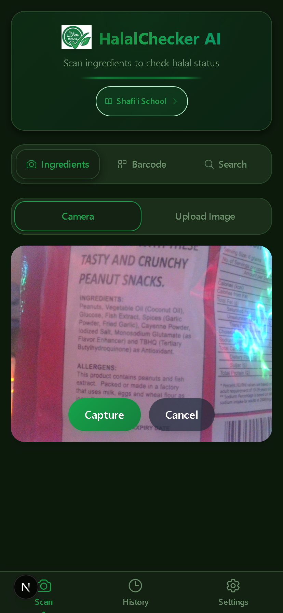

<p align="center">
  
</p>

<h1 align="center">HalalChecker AI</h1>

<p align="center">
  AI-powered halal ingredient scanner with OCR, RAG, and LLM classification.
  <br />
  Scan food labels, look up barcodes, or search ingredients — get instant halal/haram/mushbooh rulings with madhab-specific guidance.
</p>

<p align="center">
  
</p>

## Features

- **Ingredient scanning** — Camera capture or image upload with Tesseract.js OCR
- **Barcode lookup** — Scan or enter barcodes, pulls data from Open Food Facts (4M+ products)
- **Ingredient search** — Type any ingredient for instant classification
- **Madhab-aware** — Hanafi, Shafi'i, Maliki, Hanbali with school-specific rulings (seafood, vinegar, rennet, etc.)
- **RAG pipeline** — 3,300+ seeded ingredients with vector similarity search
- **Anti-hallucination** — Post-validation strips any LLM-invented ingredients not in the input
- **Fast responses** — Direct DB match for known ingredients (~100ms), LLM fallback for unknown (~5-8s)
- **Response caching** — Repeat queries return instantly (~9ms)
- **Dark mode** — System-aware with manual light/dark/system toggle
- **PWA ready** — Installable on mobile with offline shell support

## Architecture

```
┌──────────────────────────────────────────────────────┐
│              FRONTEND (Next.js 16 + PWA)              │
│  Camera → Tesseract.js OCR → Barcode → Text Search   │
│  Tailwind CSS · Dark Mode · localStorage History      │
└────────────────────┬─────────────────────────────────┘
                     │ REST API
┌────────────────────▼─────────────────────────────────┐
│              BACKEND (FastAPI)                         │
│                                                       │
│  POST /api/scan/text    (ingredients → classify)      │
│  POST /api/barcode      (Open Food Facts → classify)  │
│                                                       │
│  ┌───────────────────────────────────┐                │
│  │     CLASSIFICATION PIPELINE       │                │
│  │  1. Parse ingredients (+ parens)  │                │
│  │  2. Batch embed (MiniLM-L6-v2)   │                │
│  │  3. pgvector cosine search        │                │
│  │  4. Direct match (>0.70 sim)?     │                │
│  │     → Instant DB response         │                │
│  │     OR                            │                │
│  │  5. DeepSeek LLM + RAG context    │                │
│  │     → Validated JSON response     │                │
│  └───────────────────────────────────┘                │
│                                                       │
│  Database: PostgreSQL + pgvector (HNSW index)         │
│  • 3,317 ingredients with embeddings + rulings        │
│  • Madhab-specific rulings (4 schools)                │
└───────────────────────────────────────────────────────┘
```

## Tech Stack

| Layer | Technology |
|-------|-----------|
| Frontend | Next.js 16, React 19, Tailwind CSS 4, TypeScript |
| OCR | Tesseract.js 7 (client-side) |
| Backend | FastAPI, Python 3.11+ |
| LLM | DeepSeek API (OpenAI-compatible) |
| Embeddings | sentence-transformers (all-MiniLM-L6-v2, 384-dim) |
| Vector DB | PostgreSQL + pgvector |
| Barcode | Open Food Facts API |
| Deploy | Vercel (frontend) + Railway (backend + DB) |

## Local Development

### Prerequisites

- Python 3.11+
- Node.js 18+
- Docker (for PostgreSQL + pgvector)

### Setup

```bash
# 1. Clone
git clone https://github.com/ervenderr/halalchecker.git
cd halalchecker

# 2. Environment variables
cp .env.example .env
# Edit .env and add your DEEPSEEK_API_KEY

# 3. Start PostgreSQL
docker compose up db -d

# 4. Backend
cd backend
python -m venv venv
source venv/bin/activate      # Windows: venv\Scripts\activate
pip install -r requirements.txt
alembic upgrade head
python -m app.data.seed_knowledge
uvicorn app.main:app --reload

# 5. Frontend (new terminal)
cd frontend
npm install
npm run dev
```

Open http://localhost:3000.

### API Endpoints

| Method | Endpoint | Description |
|--------|----------|-------------|
| POST | `/api/scan/text` | Classify ingredients from text |
| POST | `/api/barcode` | Look up barcode and classify |
| GET | `/api/health` | Health check |

### Environment Variables

| Variable | Required | Description |
|----------|----------|-------------|
| `DEEPSEEK_API_KEY` | Yes | DeepSeek API key |
| `DATABASE_URL` | Yes | PostgreSQL connection string |
| `CORS_ORIGINS` | No | Allowed origins (JSON array) |
| `EMBEDDING_MODEL_NAME` | No | Default: `all-MiniLM-L6-v2` |
| `DEBUG` | No | Default: `false` |

## Deployment

### Backend (Railway)

1. Create a Railway project with PostgreSQL add-on (pgvector enabled)
2. Connect your GitHub repo, set root directory to `backend`
3. Add env vars: `DEEPSEEK_API_KEY`, `CORS_ORIGINS` (your Vercel domain)
4. Railway auto-detects the Dockerfile and `railway.toml`

### Frontend (Vercel)

1. Import your GitHub repo on Vercel
2. Set root directory to `frontend`
3. Add env var: `NEXT_PUBLIC_API_URL` = your Railway backend URL
4. Deploy

## Cost (Production)

| Service | Cost |
|---------|------|
| DeepSeek API (~1000 scans/month) | ~$0.50 |
| Vercel (frontend) | Free |
| Railway (backend + PostgreSQL) | ~$5/month |
| **Total** | **~$5.50/month** |

## License

MIT
